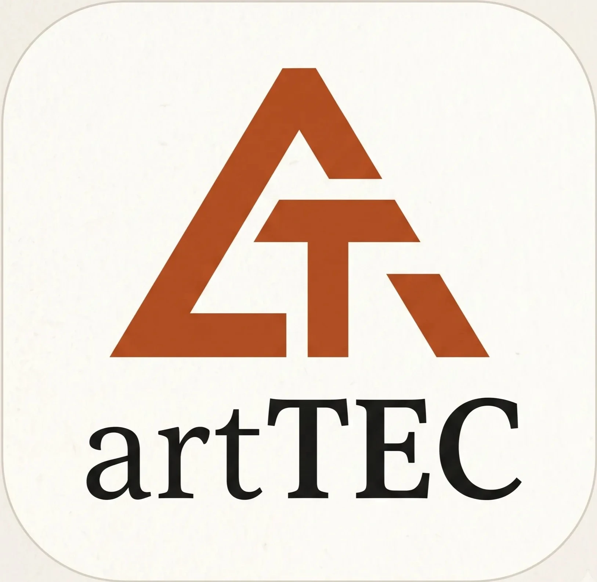

<div align="center">
  

  # ArtecWeb2 (Artec Robotics)
  
  **Plataforma Web Avanzada para Control y Gestión Robótica (ROS)**

  [](https://vuejs.org/)
  [](https://vitejs.dev/)
  [](https://tailwindcss.com/)
  [](https://expressjs.com/)
  [](https://www.ros.org/)
  [](https://www.sqlite.org/)
</div>

---

## Descripción del Proyecto

**ArtecWeb2** es la interfaz web oficial de **Artec Robotics**. Diseñada con una arquitectura moderna que separa el cliente (Frontend) y el servidor (Backend), esta plataforma permite la gestión, monitorización y control de sistemas robóticos mediante la integración directa con **ROS (Robot Operating System)**.

Además de su capacidad de control robótico, incorpora un sistema completo de autenticación de usuarios, gestión de base de datos local y capacidades de Inteligencia Artificial utilizando Transformers.

---

##  Características Principales

-  **Integración con ROS**: Comunicación bidireccional en tiempo real con sistemas robóticos utilizando `roslib`.
-  **Autenticación y Seguridad**: Sistema de login con JWT y encriptación de contraseñas mediante Bcrypt.
-  **Interfaz Moderna e Intuitiva**: SPA (Single Page Application) fluida desarrollada en Vue 3 y estilizada con Tailwind CSS.
-  **Inteligencia Artificial**: Integración de modelos de ML en el backend mediante `@xenova/transformers`.
-  **Diseño Responsivo**: Optimizado para su uso en diferentes dispositivos.
-  **Documentación Automática**: Generación de documentación de API con Swagger y documentación de código con JSDoc y Vue Docgen.

---

##  Tecnologías Utilizadas

### Frontend
- **Framework**: Vue 3 (Composition API)
- **Bundler**: Vite
- **Estilos**: Tailwind CSS 4
- **Estado**: Pinia
- **Enrutamiento**: Vue Router
- **Iconos**: Lucide Vue Next
- **ROS**: roslib

### Backend
- **Servidor**: Node.js + Express 5
- **Base de Datos**: SQLite3
- **Autenticación**: JWT (JSON Web Tokens)
- **IA**: Xenova Transformers
- **Documentación API**: Swagger UI

---

##  Instalación y Uso

### Requisitos Previos
- [Node.js](https://nodejs.org/) (v18 o superior recomendado)
- NPM (incluido con Node.js)
- Entorno ROS configurado (opcional, pero necesario para funciones de robótica)

### Instalación Rápida

1. Clona el repositorio e instala las dependencias de todos los módulos desde la raíz:
   ```bash
   npm run install:all
   ```

2. Configura las variables de entorno:
   - Copia el archivo `.env.example` a `.env` en el directorio raíz o en el backend, según sea necesario.

3. Inicializa la base de datos (Opcional):
   ```bash
   npm --prefix backend run seed
   ```

### Ejecución en Modo Desarrollo

Para iniciar tanto el frontend como el backend de manera simultánea:

```bash
npm run dev
```

- **Frontend**: Accesible normalmente en `http://localhost:5173`
- **Backend**: API accesible en el puerto configurado (por defecto suele ser `http://localhost:3000`)

---

##  Scripts Disponibles

En la raíz del proyecto (`package.json`), puedes utilizar los siguientes comandos principales:

- `npm run dev` - Inicia ambos servidores en modo desarrollo.
- `npm run build` - Compila el Frontend para producción.
- `npm run start` - Inicia el servidor Backend en modo producción.
- `npm run docs:all` - Genera toda la documentación (API, JS, Vue Componentes).

---

##  Estructura del Proyecto

```text
ArtecWeb2/
├── backend/            # Servidor Express, API REST y lógica de negocio
├── frontend/           # Aplicación cliente Vue 3 + Vite
├── docs/               # Documentación y recursos del TFG
├── artec_leds/         # Scripts o módulos específicos de hardware/LEDs
└── package.json        # Gestión de dependencias y scripts globales
```

---

<div align="center">
  <i>Desarrollado para Artec Robotics</i>
</div>
